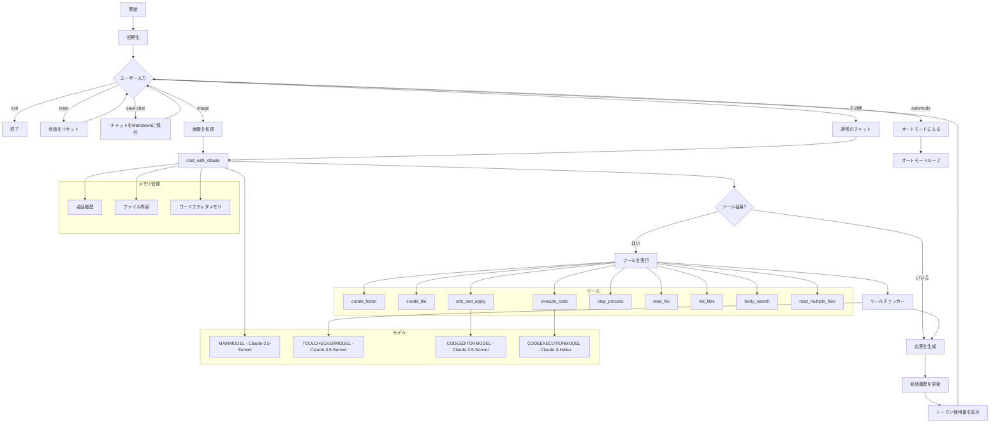

# 🤖 Claude Engineer

<a href="./docs/README_JP.md"></a>

Claude Engineerは、AnthropicのClaude 3およびClaude 3.5モデルの能力を活用して、幅広いソフトウェア開発タスクを支援する高度なインタラクティブコマンドラインインターフェース（CLI）です。このツールは、最先端の大規模言語モデルの機能と、実用的なファイルシステム操作、ウェブ検索機能、インテリジェントなコード分析、実行機能をシームレスに組み合わせています。

## 新機能

音声モード 🗣️: キーボードに触れることなく、エンジニアと直接会話できるようになりました。

音声モードに入るには以下を入力してください：
```
voice
```

通常のテキストモードに戻るには「exit voice mode」と言ってください。

プロンプトのキャッシング機能。スクリプトを実行する前に、Anthropicのpythonパッケージを更新してください。
```
pip install --upgrade anthropic
```

## ✨ 機能

- 💬 Claude 3およびClaude 3.5モデルとのインタラクティブなチャットインターフェース
- 📁 包括的なファイルシステム操作（フォルダ作成、ファイル作成、読み書き）
- 🔍 Tavily APIを使用した最新情報のウェブ検索機能
- 🌈 コードスニペットの強化された構文ハイライト
- 🏗️ インテリジェントなプロジェクト構造の作成と管理
- 🧐 高度なコード分析と改善提案
- 🖼️ ターミナルでのドラッグ＆ドロップをサポートした画像分析機能
- 🚀 効率的な自律タスク完了のための改善されたオートモード
- 🔄 オートモードでの堅牢な反復追跡と管理
- 📊 制御されたコード修正のための精密な差分ベースのファイル編集
- 🛡️ 強化されたエラー処理とツール使用の詳細な出力
- 🎨 Richライブラリを使用した読みやすさ向上のためのカラーコード化されたターミナル出力
- 🔧 ツールの使用と結果の詳細なログ記録
- 🔁 読み取りと適用のステップを分けた改善されたファイル編集ワークフロー
- 🧠 オートモードの状態に基づく動的システムプロンプトの更新
- 🔍 ツールの使用と出力を検証するためのTOOLCHECKERMODEL
- 📝 特殊なコード編集タスクのためのCODEEDITORMODEL
- 🖥️ コード実行結果を分析するためのCODEEXECUTIONMODEL
- 📊 各モデルのトークン使用量（入力、出力、合計）の追跡、テーブルを使用した改善された可視化
- 🪟 残りのコンテキストウィンドウの表示
- 💾 チャットログの保存機能
- 🔒 隔離された仮想環境による強化されたコード実行機能
- 🔄 長時間実行されるコードの実行のためのプロセス管理
- 📚 複数のファイルを効率的に同時に処理するための複数ファイル読み取り機能

## 🛠️ インストール

1. このリポジトリをクローンします：
   ```
   git clone https://github.com/doriandarko/claude-engineer.git
   cd claude-engineer
   ```

2. 必要な依存関係をインストールします：
   ```
   pip install -r requirements.txt
   ```

3. 環境変数を設定します：
   - プロジェクトのルートディレクトリに`.env`ファイルを作成します
   - 以下の環境変数を追加します：
     ```
     ANTHROPIC_API_KEY=your_anthropic_api_key
     TAVILY_API_KEY=your_tavily_api_key
     ```

4. コード実行用の仮想環境をセットアップします：
   Engineerは、コードを初めて実行する際に、コードを実行するための仮想環境を作成します。
   これは、メインスクリプトをデフォルトの環境ではなく仮想環境で実行したい場合のためのものです。
   ```
   python -m venv code_execution_env
   source code_execution_env/bin/activate  # Windowsの場合: code_execution_env\Scripts\activate
   pip install -r requirements.txt
   deactivate
   ```

## 🔧 仮想環境のセットアップ

Claude Engineerは、隔離とセキュリティを確保するために、コード実行用の専用仮想環境を使用します。仮想環境は、コードを初めて実行する際に自動的に作成されます。ただし、手動でセットアップしたりカスタマイズしたりする場合は、以下の手順に従ってください：

1. 仮想環境を作成します：
   ```
   python -m venv code_execution_env
   ```

2. 仮想環境を有効化します：
   - Windowsの場合：
     ```
     code_execution_env\Scripts\activate
     ```
   - macOSとLinuxの場合：
     ```
     source code_execution_env/bin/activate
     ```

3. 必要な依存関係をインストールします：
   ```
   pip install -r requirements.txt
   ```

4. 終了時に仮想環境を無効化します：
   ```
   deactivate
   ```

code_execution_env仮想環境は、すべてのコード実行タスクに使用され、ユーザーコードを実行するための一貫した隔離環境を確保します。

## 🚀 使用方法

メインスクリプトを実行してClaude Engineerインターフェースを起動します：

```
python main.py
```

起動後、クエリやコマンドを入力してClaude Engineerとやり取りできます。いくつかの対話例：

- "Webアプリケーション用の新しいPythonプロジェクト構造を作成して"
- "file.pyのコードを説明し、改善点を提案して"
- "React開発の最新のベストプラクティスを検索して"
- "このエラーのデバッグを手伝って：[エラーメッセージを貼り付け]"
- "この画像を分析して内容を説明して"
- "このPythonコードを実行して結果を分析して"
- "複数のファイルを読み込んで：file1.py、file2.py、file3.py"

特別なコマンド：
- 'exit'と入力すると会話を終了し、アプリケーションを閉じます。
- 'image'と入力すると、分析用の画像をメッセージに含めることができます。
- 'reset'と入力すると、スクリプトを再起動せずに会話全体をリセットします。
- 'automode number'と入力すると、指定した回数の反復を行う自律モードに入ります。
- 'save chat'と入力すると、現在のチャットログを保存します。
- いつでもCtrl+Cを押すと、オートモードを終了して通常のチャットに戻ります。

各対話の後、Claude Engineerは以下を表示します：
- 現在のモデルのトークン使用量（入力、出力、合計）
- 残りのコンテキストウィンドウのサイズ

### コード実行とプロセス管理

Claude Engineerは現在、隔離された'code_execution_env'仮想環境でのコード実行をサポートしています：

1. `execute_code`ツールを使用して、Pythonコードを安全に隔離環境で実行します。
2. 長時間実行されるプロセスは、`execute_code`が返すプロセスIDを使用して管理できます。
3. CODEEXECUTIONMODELが実行結果を分析し、洞察を提供します。

### 異なるAIモデルの使用

Claude Engineerは複数の専門化されたAIモデルを利用します：

- MAINMODEL：一般的な対話とタスク処理を行うClaude 3またはClaude 3.5
- TOOLCHECKERMODEL：ツールの使用と出力を検証します
- CODEEDITORMODEL：特殊なコード編集タスクを実行します
- CODEEXECUTIONMODEL：コード実行結果を分析します

スクリプトは自動的にタスクに応じて適切なモデルを選択します。

### 🤖 改善されたオートモード

強化されたオートモードにより、Claudeは複雑なタスクを自律的に、より効率的にコントロールしながら作業することができます。オートモード時：

1. Claudeはあなたの要求に基づいて明確で達成可能な目標を設定します。
2. これらの目標を1つずつ、必要に応じて利用可能なツールを使用しながら作業します。
3. Claudeは進捗状況を定期的に更新し、現在の反復回数を含めて報告します。
4. オートモードは目標が完了するか、最大反復回数に達するまで継続します。
5. オートモードに入る際に最大反復回数を指定できます（デフォルトは25回）。
6. Claudeは進捗状況や遭遇した障害に基づいて動的にアプローチを調整します。
7. TOOLCHECKERMODELがツールの使用と出力を検証し、信頼性を高めます。

オートモードの使用方法：
1. 入力を求められたら'automode number'と入力します。numberは最大反復回数です。
2. プロンプトが表示されたら、あなたの要求を入力します。
3. Claudeは自律的に作業し、各反復後に更新情報を提供します。
4. オートモードは、タスクが完了した時、最大反復回数に達した時、またはCtrl+Cを押した時に終了します。

### 📊 強化された差分ベースのファイル編集

Claude Engineerは現在、より精密で制御されたファイル修正を可能にする改善された差分ベースのファイル編集システムをサポートしています。新しいワークフローには以下が含まれます：

1. `edit_and_apply`関数を使用して、新しい内容を提供せずにファイルの全内容を読み取ります。
2. `edit_and_apply`関数を新しい内容とともに使用してファイルに変更を適用し、提案された変更の詳細な差分を表示します。
3. 高品質な修正を確保するために、特殊なコード編集タスクにCODEEDITORMODELを利用します。

ファイルを編集する際、Claudeは以下を行います：

1. 提案された変更の詳細な差分を表示し、Richライブラリを使用してカラーコードで追加、削除、変更されていない行をハイライトします。
2. 機能を不必要に削除することなく、新しいコードの追加や既存のコードの修正に焦点を当てます。
3. 追加および削除された行数の要約を提供します。
4. 重複や不要な置換を避けるように注意深く変更を適用します。
5. ターゲットを絞った変更、内容の追加、先頭への挿入、ファイル全体の内容の置換など、様々な編集シナリオをサポートします。
6. CODEEDITORMODELを使用して、コードの変更がベストプラクティスに従い、一貫性を維持していることを確認します。

この機能により、Claudeは既存の機能の整合性を維持しながら、コードベースに対してターゲットを絞った改善を行う能力が向上します。

### 🧠 動的システムプロンプト

システムプロンプトは現在、スクリプトがオートモードであるかどうかに基づいて動的に更新されます。これにより、現在の操作モードに応じてより適切な指示と動作が可能になります：

1. 通常モードでは、Claudeは役立つ応答の提供と必要に応じたツールの使用に焦点を当てます。
2. オートモードでは、Claudeは自律的に作業し、目標を設定し、進捗状況を定期的に更新するよう指示されます。
3. システムプロンプトは特定のタスクに適応し、各シナリオでのClaudeのパフォーマンスを最適化します。
4. システムプロンプトは現在、強化されたトークン管理のためにファイルコンテキストを含んでいます。

動的システムプロンプトにより、Claudeは異なるシナリオに適応し、より関連性の高い支援を提供する能力が向上します。

### 📊 トークン管理と可視化

Claude Engineerには現在、改善されたトークン管理と可視化機能が搭載されています：

1. システムプロンプト内のファイルコンテキストを使用した強化されたトークン管理。
2. テーブル形式を使用した改善されたトークンの可視化。
3. 各モデルの対話における入力、出力、および合計トークン使用量の表示。
4. 残りのコンテキストウィンドウサイズの可視化。

これらの改善により、トークン使用量についてのより良い洞察が得られ、会話をより効果的に管理するのに役立ちます。

### 🔧 利用可能なツール

Claude Engineerには、様々なタスクを支援するための強力なツールセットが付属しています：

1. create_folder: 指定されたパスに新しいフォルダを作成します。
2. create_file: 指定されたパスに内容を含む新しいファイルを作成します。
3. edit_and_apply: ファイルの内容を読み取り、オプションで変更を適用します。
4. read_file: 指定されたパスのファイルの内容を読み取ります。
5. read_multiple_files: 指定された複数のパスのファイルの内容を読み取ります。
6. list_files: 指定されたフォルダ内のすべてのファイルとディレクトリをリストアップします。
7. tavily_search: Tavily APIを使用してウェブ検索を実行し、最新の情報を取得します。
8. execute_code: 隔離された仮想環境でPythonコードを実行します。
9. stop_process: 長時間実行されるコードの実行を管理および停止します。
10. TOOLCHECKERMODEL: 信頼性を高めるためにツールの使用と出力を検証します。
11. CODEEDITORMODEL: 高精度の特殊なコード編集タスクを実行します。
12. CODEEXECUTIONMODEL: コード実行結果を分析し、洞察を提供します。

これらのツールにより、Claudeはファイルシステムとの対話、プロジェクト構造の管理、ウェブからの情報収集、高度なコード編集、安全なコード実行を行うことができます。

### 🖼️ 画像分析

Claude Engineerは現在、画像分析機能をサポートしています。この機能を使用するには：

1. 入力を求められたら'image'と入力します。
2. 画像ファイルをターミナルにドラッグ＆ドロップするか、ファイルパスを提供します。
3. 画像に関するプロンプトまたは質問を提供します。
4. Claudeが画像を分析し、あなたの質問に回答します。

この機能により、Claudeは図表、スクリーンショット、その他の開発作業に関連する視覚的データを含むタスクを支援することができます。

### 🛡️ エラー処理と回復

Claude Engineerは堅牢なエラー処理と回復メカニズムを実装しています：

1. APIエラーやネットワーク問題の適切な処理。
2. 一時的な障害に対する自動再試行。
3. 必要に応じて、明確なエラーメッセージとユーザーアクションの提案。
4. デバッグと改善のためのエラーのログ記録。
5. 重大でないエラーの後に回復して操作を継続する能力。
6. 必要に応じて長時間実行されるプロセスを安全に終了する能力。

これらの機能により、予期しない問題や複雑なコード実行に直面しても、スムーズで信頼性の高いユーザー体験が確保されます。

### 💾 チャットログの保存

Claude Engineerとの対話中、いつでも現在のチャットログを保存することができます：

1. 入力を求められたら'save'と入力します。
2. チャットログは現在のディレクトリにタイムスタンプを含むファイル名で保存されます。
3. これらのログは後で参照したり、以前の会話を続けたりするために確認することができます。

## 🧠 AIモデルと専門化されたエージェント

Claude Engineerは、専門的な機能を提供するために複数のAIモデルを利用しています：

1. MAINMODEL（Claude 3またはClaude 3.5）：一般的な対話とタスク処理を扱います。
2. TOOLCHECKERMODEL：信頼性を確保するために様々なツールの使用と出力を検証します。
3. CODEEDITORMODEL：高品質の修正を確保するためのコード編集タスクを専門とします。
4. CODEEXECUTIONMODEL：コード実行結果を分析し、洞察を提供します。

これらのモデルが協力して、包括的でインテリジェントな開発支援体験を提供します。

## ワークフローダイアグラム



## 👥 貢献

貢献は歓迎します！お気軽にプルリクエストを提出してください。大きな変更については、まず問題を開いて変更したい内容について議論してください。

## 🦙 Ollama engがここにあります

このスクリプトのパワーを、Ollamaとサポートされている関数呼び出しモデルのいずれかを使用して、完全にローカルで利用できるようになりました：
Llama 3.1
Mistral Nemo
Firefunction v2
Command-R +

実行する前に、最新バージョンのOllamaアプリをインストールし、以下を実行してください：

```
pip install ollama
```

その後、

```
python ollama-eng.py
```

### 🚨Ollama Engineerを使用する際の安全性に関する重要な注意事項！

これらのローカルモデルにマシン上でコードを実行させる場合、特にコード実行ツールを使用する際は、細心の注意を払ってください。マシンに深刻な障害を引き起こす可能性があります。OLLAMA engineerではツール実行を完全に無効化していますが、オリジナルのスクリプトに基づいて再度実装する場合は、自己責任で使用してください。

## Star History

[](https://star-history.com/#Doriandarko/claude-engineer&Date)
